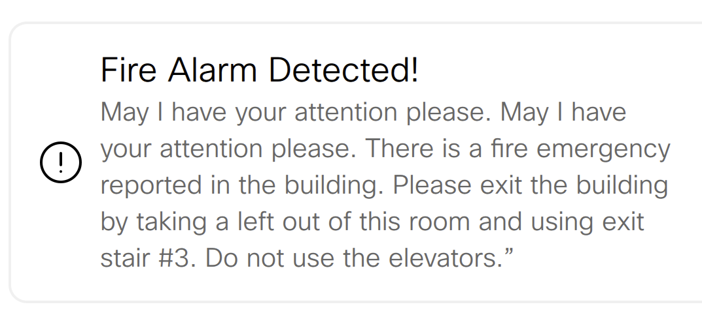

# Webex Rooms Device - Room T3 Alarm Detected Alert 
This macro displays an alert on the device when a fire alarm is detected - Based on T3Alarm API

Example of the UI of the alert displayed on the UI of the device:

## Requirements
1. Cisco Webex Room Device (Room, Board or Desk Series)

## Additional Information
##### xAPI
Documentation for the xAPI can be found in the [Command References overview](https://www.cisco.com/c/en/us/support/collaboration-endpoints/telepresence-quick-set-series/products-command-reference-list.html).

## Disclaimer
This example is only a sample and is **NOT guaranteed to be bug free and production quality**.
